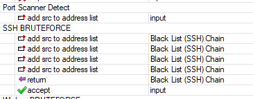
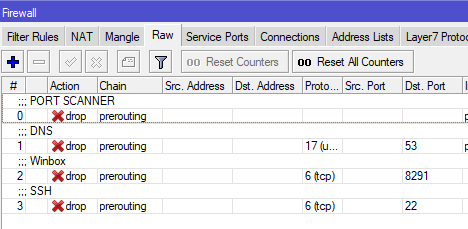

# PSD and Bruteforce Firewall

This is a firewall rule to detect and block Port Scanner and Bruteforce Attacks.

This can be adjusted to your needs, just change the ports.

The blocked addresses are dropped on the RAW table.

